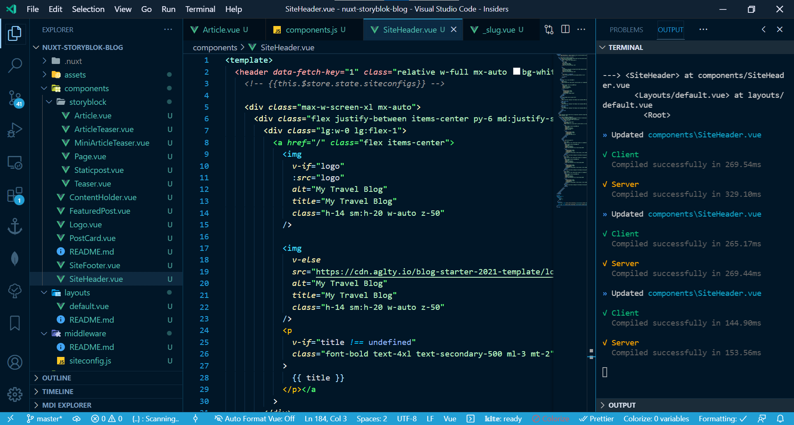
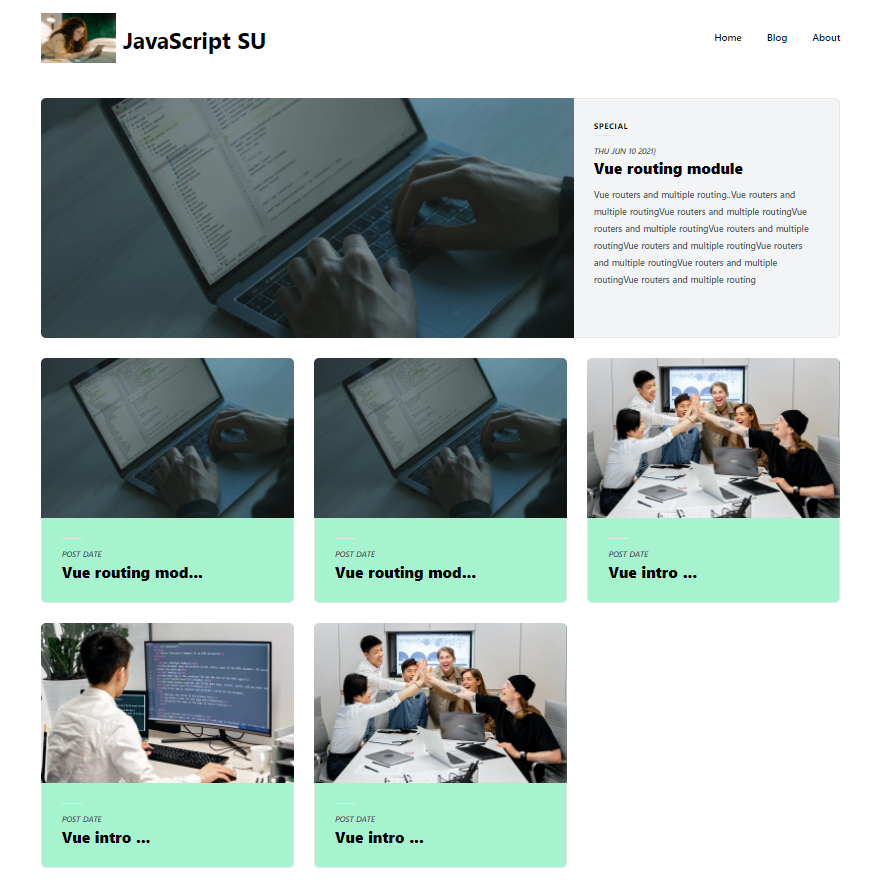
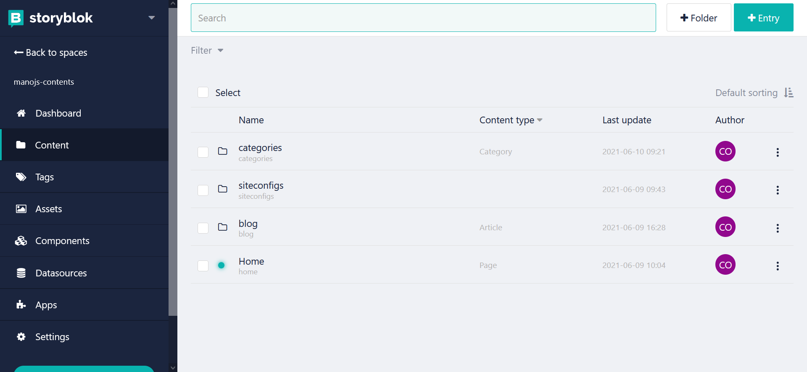
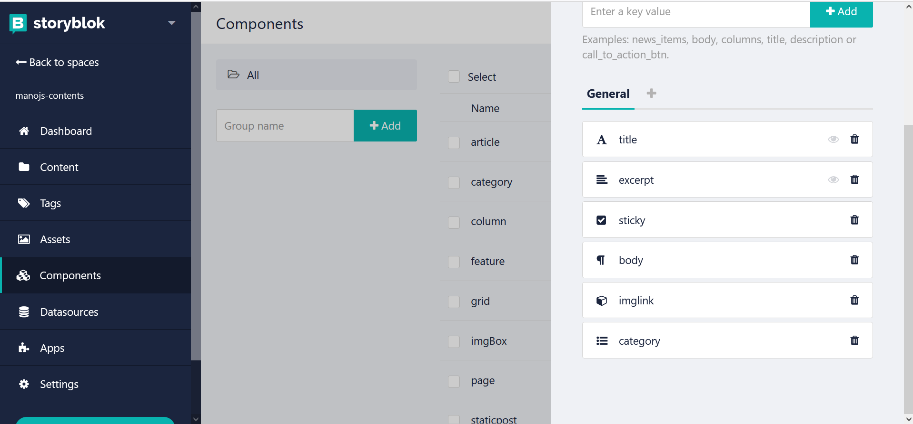

# nuxt-storyblok-blog
This is a **headless CMS** web app with blog section which is ideal for an Organization. The **StoryBlok** CMS** store the data and vue fetches the data using API. Users can edit Story block contents.

Vercel [Demo](https://nuxt-storyblok-blog.vercel.app)




The Project uses

1. Storyblok CMS
2. Vue/Nuxtjs
3. Tailwind CSS

# Requirements

1. Nodejs
2. Yarn/npm [Node Package Manager]
3. Vuejs
4. Nuxtjs
5. Tailwind CSS
6. Storyblok package

# Screen Shots





## Build Setup

```bash
# install dependencies
$ npm install

# serve with hot reload at localhost:3000
$ npm run dev

# build for production and launch server
$ npm run build
$ npm run start

# generate static project
$ npm run generate
```

For detailed explanation on how things work, check out [Nuxt.js docs](https://nuxtjs.org).
